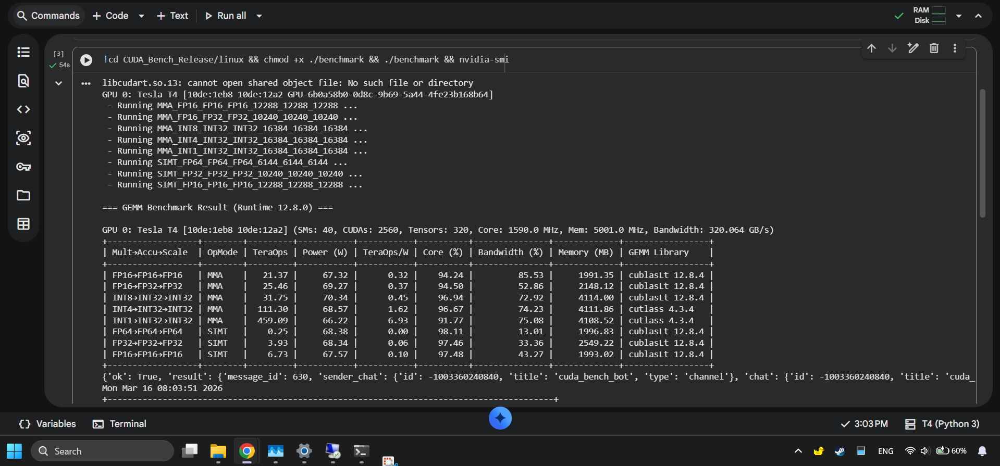
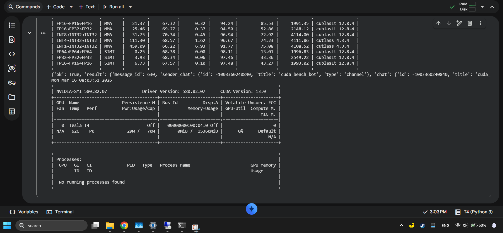
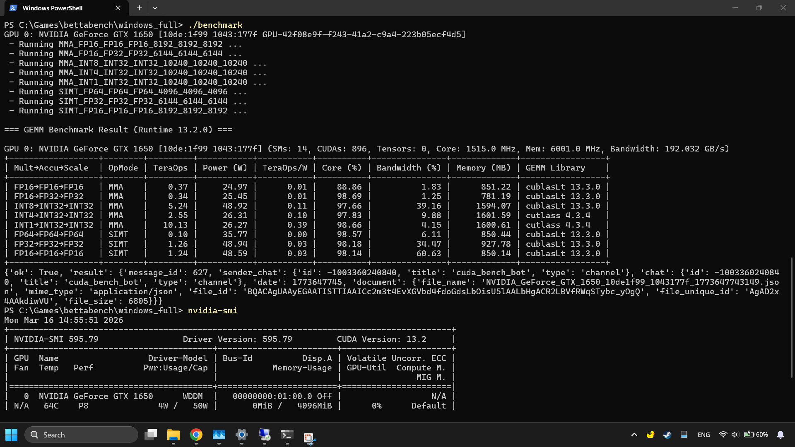
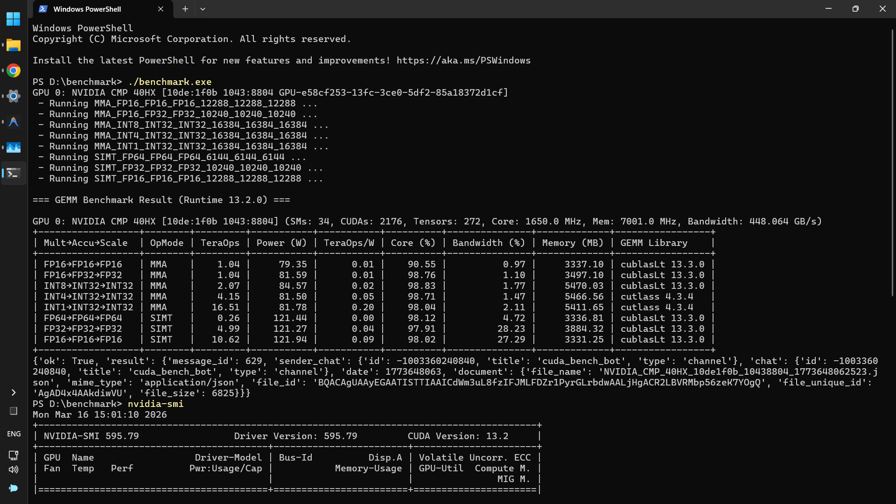
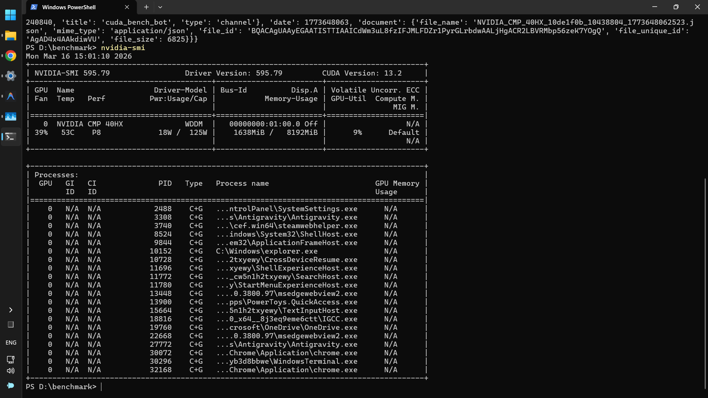

Binary releases of the upcoming Betta CUDA Bench for Linux & Windows, support all NVIDIA Consumer & Datacenter GPUs starting from Pascal. 
- CUDA 12.9
- CUDA 13.2

# Quick Demo:
### Linux: 
   Available on Google Colab Notebook
   1. [Google Colab Notebook - Tesla T4](https://colab.research.google.com/drive/1gLlbxaKMY7Np0l7JRkwevfgwHdQ-cIWf?usp=sharing)
      
      
   
### Windows: 
   Not publicly available for now. Check back later.
   1. GTX 1650 Laptop
      
   3. Headless CMP 40HX
      
      
   
